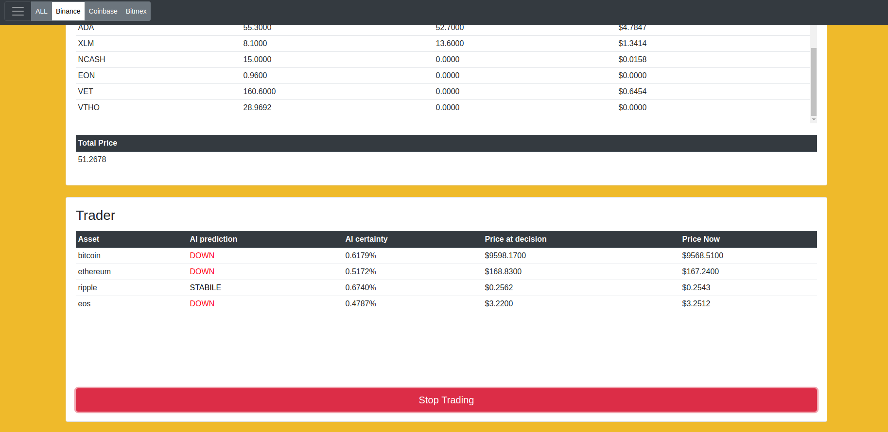
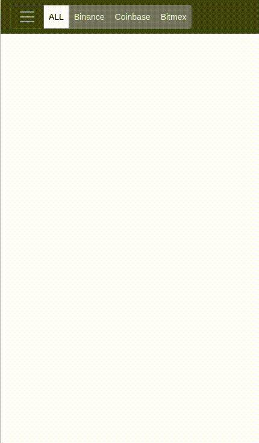

# Cryptocurrency Trading with DQL & CNN

With this project I tested two different approaches to trading:
* Recurrent Neural Network with Q-learning
* Convolutional Neural Network

The Q-learning network was trained on an environment that was based on real data, which was programmed in python. With a small network the agent learned to trade reasonably good, but it is not suitable for real life applications due to high error rate. A deeper network can potentially improve the performance, but more computational power will be necessary to handle the network, for this reason I stopped improving the Q-learning approach. 
The model itself is not included in this repo., but the environment and other related files are. (Find ["q_model"](https://github.com/Vahegian/MM_py/tree/master/python/AI/q_model) folder).   

## Q agent learns to trade

 

Many convolutional neural networks were tested ranging from 8 to 20 layers. 
The deeper networks had a tendency to over-fit the data, thus the model wasn't getting appropriately generalized to the data. 

After implementing techniques such as "dropout" and "learning rate decay" as well as using smaller number of neurons in each layer didn't seem to improve the performance greatly. 
The 8 layer deep network, which was faster to train, (thus to evaluate) was better at guessing on real life data than the deeper ones, so I trusted it to trade in real time on real data. The model is not perfect it didn't reach accuracy of 90% on real data, but in most cases it was more than 67% certain of the decisions, which were accurate reflections of the reality.

The actual kernel sizes and layer parameters can be found in ["cnn.py"](https://github.com/Vahegian/MM_py/blob/master/python/AI/NeuralNetworks/cnn.py) file.

## CNN Predictions on real data

 

A server was programmed with node.js that hosts the model and website content, which makes it easy to see what is happening to the markets and what trades are being made by the model. The web site is optimized to work on both desktop and mobile devices.  

## Website demo

 

The ["python"](https://github.com/Vahegian/MM_py/tree/master/python) folder contains "readme" files that explain how to train and use the Neural Network without the "node.js" [server](https://github.com/Vahegian/MM_py/tree/master/server). 

